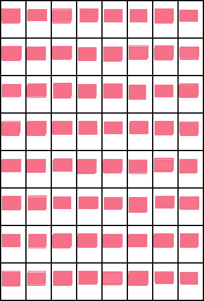
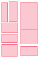

<div align="center">

# Manga Panel Layout Generator with LayoutGAN++

[](https://www.python.org/)
[](https://pytorch.org/)
[](https://developer.nvidia.com/cuda-toolkit)
[](https://www.docker.com/)

**AI-powered automatic manga panel position prediction and layout generation project.**

This project aims to create automatic panel layouts for manga pages using the LayoutGAN++ architecture. It predicts optimal placement for manga pages with different panel counts using deep learning and GAN technology.

<div align="center">
  
  <p><i>Model training process</i></p>
</div>

## 🎨 Sample Outputs

| 3-Panel Page                                                    | 8-Panel Page                                                    |
|:---------------------------------------------------------------:|:---------------------------------------------------------------:|
|  |  |
| Automatically generated layout for 3 panels                     | Automatically generated layout for 8 panels                     |

---

## 🌐 Language / Dil

**[English](#english)** | **[Türkçe](#türkçe)**

</div>

---

<a name="english"></a>

# 📖 English Documentation

## 📦 Installation

### Requirements

- Docker
- NVIDIA GPU (recommended)
- NVIDIA Docker runtime

### Build Docker Image

```bash
docker build -t const_layout_image .
```

### Download Dataset

Download the manga panel dataset from Google Drive and place it in the `data/dataset/` folder:

**Dataset Link:** [Manga Panel Dataset](https://drive.google.com/file/d/1aEpHR-C64ONnZFlVybe-Ccbm18sJKJ7t/view?usp=sharing)

```bash
# After downloading the dataset
unzip manga_dataset.zip -d data/dataset/
```

---

## 🚀 Running

### Start Container

```bash
docker run --gpus all -it --name const_layout_container \
  -v $(pwd)/output:/app/output \
  const_layout_image
```

> **Note:** The Docker image includes all necessary dependencies. No conda or manual installation required.

### Alternative: Development Mode

If you want to modify the code, mount the entire project:

```bash
docker run --gpus all -it --name const_layout_container \
  -v $(pwd):/app \
  -w /app \
  const_layout_image
```

In this case, download pretrained models inside the container:

```bash
bash download_model.sh
```

---

## 🎓 Model Training

Training with manga panel dataset:

```bash
python train.py \
  --dataset publaynet \
  --batch_size 64 \
  --iteration 200000 \
  --latent_size 4 \
  --lr 1e-5 \
  --G_d_model 256 \
  --G_nhead 4
```

> **Note:** Make sure the dataset is in the `data/dataset/` folder before training.

### Key Parameters

- `--dataset`: Dataset selection (using manga dataset)
- `--batch_size`: Batch size (default: 64)
- `--iteration`: Total iteration count (default: 200000)
- `--latent_size`: Latent vector size (default: 4)
- `--lr`: Learning rate (default: 1e-5)
- `--G_d_model`: Generator model size (default: 256)
- `--G_nhead`: Number of attention heads (default: 4)

Training outputs are saved to the `output/` folder:

- `checkpoint.pth.tar` - Latest checkpoint
- `model_best.pth.tar` - Best model
- TensorBoard log files

---

## 🎨 Layout Generation

### Quick Test - With Pretrained Model

If you want to test without training your own model, use the pretrained model:

**Pretrained Model Link:** [model_best.pth.tar](https://drive.google.com/file/d/1Cy1wM4wV2YP_hx7xQTw3NF8fySEDvslk/view?usp=sharing)

```bash
# After downloading the model
docker run --gpus all -it --name const_layout_container \
  -v $(pwd):/app \
  -w /app \
  const_layout_image

# Inside container
python generate.py model_best.pth.tar \
  --num_elements 3 \
  --num_save 1 \
  --out_path output/test_layout.pkl
```

This command will generate a 3-panel manga page layout and save it to the `output/` folder.

### Generate with Your Own Model

```bash
python generate.py model_best.pth.tar \
  --num_elements 8 \
  --num_save 1 \
  --out_path output/layouts.pkl
```

### Parameters

- `--num_elements`: Number of panels per layout (default: 10)
- `--num_save`: How many layouts to generate (default: 1)
- `--out_path`: Output file path

---

## 📁 Project Structure

```
├── train.py              # Training script
├── generate.py           # Panel layout generation
├── eval.py               # Model evaluation
├── metric.py             # Metric computation
├── util.py               # Utility functions
├── Dockerfile            # Docker definition
├── requirements.txt      # Python dependencies
├── download_model.sh     # Pretrained model downloader
├── image/                # Sample images
│   ├── training.gif
│   ├── 3_panel.png
│   └── 8_panel.png
├── model/                # Model architectures
│   ├── layoutganpp.py    # LayoutGAN++ generator & discriminator
│   └── layoutnet.py      # LayoutNet (for FID metrics)
└── data/                 # Dataset modules
    ├── __init__.py
    ├── base.py
    └── dataset/          # Manga panel dataset (you need to download)
```

---

## 💡 Usage Examples

### 3-Panel Manga Page

```bash
python generate.py model_best.pth.tar --num_elements 3 --out_path output/manga_3panel.pkl
```

### 8-Panel Manga Page

```bash
python generate.py model_best.pth.tar --num_elements 8 --out_path output/manga_8panel.pkl
```

### Batch Generation (100 pages)

```bash
python generate.py model_best.pth.tar --num_save 100 --num_elements 6 --out_path output/batch.pkl
```

### Quick Test Training

```bash
python train.py --dataset manga --batch_size 32 --iteration 50000 --name quick_test
```

---

## 🔧 Docker Management

```bash
# Stop container
docker stop const_layout_container

# Restart container
docker start -i const_layout_container

# Copy outputs
docker cp const_layout_container:/app/output ./output
```

---

## 📊 About the Dataset

This project uses a specially prepared dataset for manga panel layouts. The dataset is derived from the **MangaZero** dataset and contains panel positions from manga pages.

---

## 🙏 Acknowledgments

This project uses the following resources:

### Dataset

- **MangaZero Dataset**: [Hugging Face](https://huggingface.co/datasets/jianzongwu/MangaZero)
  - Thanks for providing the manga panel data

### Reference Project

- **LayoutGAN++**: [GitHub Repository](https://github.com/ktrk115/const_layout)
  - For panel layout research

### Model Architecture

- **LayoutGAN++**: [Paper](https://arxiv.org/abs/1901.06767)
  - Transformer-based GAN architecture for layout generation

---

---

<a name="türkçe"></a>

# 📖 Türkçe Dokümantasyon

## 📦 Kurulum

### Gereksinimler

- Docker
- NVIDIA GPU (önerilen)
- NVIDIA Docker runtime

### Docker Image Oluşturma

```bash
docker build -t const_layout_image .
```

### Dataset İndirme

Manga panel dataset'ini Google Drive'dan indirin ve `data/dataset/` klasörüne yerleştirin:

**Dataset Linki:** [Manga Panel Dataset](https://drive.google.com/file/d/1aEpHR-C64ONnZFlVybe-Ccbm18sJKJ7t/view?usp=sharing)

```bash
# Dataset'i indirdikten sonra
unzip manga_dataset.zip -d data/dataset/
```

---

## 🚀 Çalıştırma

### Container Başlatma

```bash
docker run --gpus all -it --name const_layout_container \
  -v $(pwd)/output:/app/output \
  const_layout_image
```

> **Not:** Docker image'ı tüm gerekli bağımlılıkları içerir. Conda veya manuel kurulum gerekmez.

### Alternatif: Kod Geliştirme Modu

Kod değişikliği yapmak istiyorsanız tüm projeyi mount edebilirsiniz:

```bash
docker run --gpus all -it --name const_layout_container \
  -v $(pwd):/app \
  -w /app \
  const_layout_image
```

Bu durumda container içinde pretrained modelleri indirmeniz gerekir:

```bash
bash download_model.sh
```

---

## 🎓 Model Eğitimi

Manga panel dataset ile eğitim:

```bash
python train.py \
  --dataset publaynet \
  --batch_size 64 \
  --iteration 200000 \
  --latent_size 4 \
  --lr 1e-5 \
  --G_d_model 256 \
  --G_nhead 4
```

> **Not:** Eğitim öncesinde dataset'in `data/dataset/` klasöründe bulunduğundan emin olun.

### Temel Parametreler

- `--dataset`: Dataset seçimi (manga dataset kullanılıyor)
- `--batch_size`: Batch boyutu (varsayılan: 64)
- `--iteration`: Toplam iterasyon sayısı (varsayılan: 200000)
- `--latent_size`: Latent vektör boyutu (varsayılan: 4)
- `--lr`: Learning rate (varsayılan: 1e-5)
- `--G_d_model`: Generator model boyutu (varsayılan: 256)
- `--G_nhead`: Attention head sayısı (varsayılan: 4)

Eğitim çıktıları `output/` klasörüne kaydedilir:

- `checkpoint.pth.tar` - Son checkpoint
- `model_best.pth.tar` - En iyi model
- TensorBoard log dosyaları

---

## 🎨 Layout Üretimi

### Hızlı Test - Eğitilmiş Model ile

Kendi modelinizi eğitmeden test etmek istiyorsanız, hazır eğitilmiş modeli kullanabilirsiniz:

**Eğitilmiş Model Linki:** [model_best.pth.tar](https://drive.google.com/file/d/1Cy1wM4wV2YP_hx7xQTw3NF8fySEDvslk/view?usp=sharing)

```bash
# Modeli indirdikten sonra
docker run --gpus all -it --name const_layout_container \
  -v $(pwd):/app \
  -w /app \
  const_layout_image

# Container içinde
python generate.py model_best.pth.tar \
  --num_elements 3 \
  --num_save 1 \
  --out_path output/test_layout.pkl
```

Bu komut 3 panelli bir manga sayfası düzeni oluşturacak ve `output/` klasörüne kaydedecektir.

### Kendi Modeliniz ile Layout Üretme

```bash
python generate.py model_best.pth.tar \
  --num_elements 8 \
  --num_save 1 \
  --out_path output/layouts.pkl
```

### Parametreler

- `--num_elements`: Her layout'taki panel sayısı (varsayılan: 10)
- `--num_save`: Kaç layout üretileceği (varsayılan: 1)
- `--out_path`: Çıktı dosya yolu

---

## 📁 Proje Yapısı

```
├── train.py              # Eğitim scripti
├── generate.py           # Panel layout üretme
├── eval.py               # Model değerlendirme
├── metric.py             # Metrik hesaplama
├── util.py               # Yardımcı fonksiyonlar
├── Dockerfile            # Docker tanımı
├── requirements.txt      # Python bağımlılıkları
├── download_model.sh     # Pretrained model indirme
├── image/                # Örnek görseller
│   ├── training.gif
│   ├── 3_panel.png
│   └── 8_panel.png
├── model/                # Model mimarileri
│   ├── layoutganpp.py    # LayoutGAN++ generator & discriminator
│   └── layoutnet.py      # LayoutNet (FID metrikleri için)
└── data/                 # Dataset modülleri
    ├── __init__.py
    ├── base.py
    └── dataset/          # Manga panel dataset (indirmeniz gerekiyor)
```

---

## 💡 Kullanım Örnekleri

### 3 Panelli Manga Sayfası

```bash
python generate.py model_best.pth.tar --num_elements 3 --out_path output/manga_3panel.pkl
```

### 8 Panelli Manga Sayfası

```bash
python generate.py model_best.pth.tar --num_elements 8 --out_path output/manga_8panel.pkl
```

### Toplu Üretim (100 sayfa)

```bash
python generate.py model_best.pth.tar --num_save 100 --num_elements 6 --out_path output/batch.pkl
```

### Kısa Test Eğitimi

```bash
python train.py --dataset manga --batch_size 32 --iteration 50000 --name quick_test
```

---

## 🔧 Docker Yönetimi

```bash
# Container'ı durdur
docker stop const_layout_container

# Container'ı yeniden başlat
docker start -i const_layout_container

# Çıktıları kopyala
docker cp const_layout_container:/app/output ./output
```

---

## 📊 Dataset Hakkında

Bu proje, manga panel düzenleri için özel olarak hazırlanmış bir dataset kullanmaktadır. Dataset, **MangaZero** veri setinden türetilmiştir ve manga sayfalarındaki panel pozisyonlarını içermektedir.

---

## 🙏 Teşekkürler

Bu proje aşağıdaki kaynakları kullanmaktadır:

### Dataset

- **MangaZero Dataset**: [Hugging Face](https://huggingface.co/datasets/jianzongwu/MangaZero)
  - Manga panel verilerini sağladıkları için teşekkürler

### Referans Proje

- **LayoutGAN++**: [GitHub Repository](https://github.com/ktrk115/const_layout)
  - Panel düzenleme araştırmaları için

### Model Mimarisi

- **LayoutGAN++**: [Paper](https://arxiv.org/abs/1901.06767)
  - Layout generation için transformer tabanlı GAN mimarisi
